# F7/F8 — consegna e revisione F5/F6

Aggiornamento: 2026-10-04. Implementazione integrata in `main` con la
[PR #14](https://github.com/yabanana/phosphor/pull/14), merge `91b51c2`.
La [PR #15](https://github.com/yabanana/phosphor/pull/15) ha verificato i
worker isolati, ma il proprietario ne ha rifiutato il costo (F8.4 riaperta il
2026-10-03). **F8.4 è ora risolta in-process**: lo scaler MetalFX 40.9 tiene un
autoriferimento forte nel suo filtro interno e il motore lo rilascia con
`metalfx_lifetime` ([causa, rimedio e verifiche](research/2026-10-04-metalfx-cycle-root-cause.md));
i worker restano opt-in ([prove e costi storici](F8_METALFX_LIFETIME.md)).
**F7/F8 sono DEVELOPMENT_ACCEPTED sul M5.** La batteria nativa F6 falliva
per riferimenti precedenti alla correzione F7 di normali e tangenti
specchiate (`70a64d8`): attribuita e rigenerata, 40/40
([dettagli](research/2026-10-04-metalfx-cycle-root-cause.md)). Il riproduttore SDK con rilascio
semplice resta negativo per costruzione: è il controllo negativo del rimedio. T0 fisico rimane esterno. Nessuna fase OPT
avviata. Stato delle caselle: [roadmap](ROADMAP.md). Contratti e comandi:
[guida renderer](RENDERING_F7_F8.md). Dati compatti:
[risultati JSON](results/F7-F8-M5Max-2026-10-03.json).

## Ambito consegnato

| Task | Implementazione e verifica |
|---|---|
| F7.1 | ID R32Uint 25+7 con sentinel e limite espliciti; due tabelle di candidati A/B, overflow nel forward indexed. Roundtrip CPU e readback GPU di ID/range. |
| F7.2 | Attributi e gradienti prospettici dalla GPU scene, formulazione omogenea valida al near plane. Test analitici e confronto reale Sponza/forward. |
| F7.3 | Quattro classi di materiale, code bounded e dispatch indiretti. Immagini esatte contro generic; **generic è il default misurato**, binning opt-in. |
| F7.4 | Prototipo on-tile con imageblock ID implicito; raster/shading fusi con frustum, ID memoryless, guide in texture. Immagini esatte. **Rimandata l'adozione**. T0 e contatori DRAM hardware non misurati. |
| F7.5 | Prototipo 2×2 da storia di luminanza/identità, filtri conservativi su moto/materiali/bordi. Moto per pixel, costo storia incluso. **Non adottato** nel preset corrente. |
| F7.6 | HDR, normali signed/roughness, albedo diffusa/speculare, motion/depth/reactive. Readback di intervalli, fixture analitiche albedo/Fresnel e controlli negativi. |
| F7.7 | Opaque → alpha-test in ogni fase del culling; cutoff/mip condivisi come contratto. Alpha blending resta F16. Sponza reale e confronti culling off/frustum/two-phase. |
| F8.1 | RGBA16F lineare, istogramma log in compute, trim/adattamento per dt e vista. Oracolo CPU su pixel HDR e distribuzione GPU; clip di esposizione. |
| F8.2 | ACES fit, AgX fit, curva custom, SDR/EDR extended-linear sRGB con headroom osservato. 576 campioni GPU su rampe/colori e headroom 1/2/8. Presentazione EDR/resize verificata; nessuna certificazione fotometrica in nit. |
| F8.3 | Halton, motion current→previous in pixel non jittered, pose per vista e incarnazione. Oracolo GPU/CPU e poison della storia devono distinguere formula corretta da dati della frame sbagliata. |
| F8.4 | MetalFX Metal 4 creato sui worker, pass External con fence del grafo, fallback native durante resize, DRS ≤2× anche su output dispari. Viste 1–4, prove con 1/2/3 frame in volo. Estensioni senza consumatore restano candidate. Il ciclo SDK è confinato nel worker, recuperato al rilascio: [verifica lifetime](F8_METALFX_LIFETIME.md). Il percorso diretto resta diagnostico. |
| F8.5 | Bias dal rapporto input/output e sharpening adattivo clamped. Confronto allo stesso input scale con bias neutro e sharpening nonzero. |
| F8.6 | Registro comune per Hi-Z e ricostruzione, segnali/matrici distinti, invalidazioni per scena/cut/extent/shader generation, retirement conservativo. Nessun alias temporale generale. |
| F8.7 | Clip da 480 frame, tre camera cut, moto rapido, dettagli/alpha e oggetti animati; clip aggiuntive esposizione e DRS/due viste. Riferimento HDR supersampled prima del tonemapping; negativi ritardati falliscono. |

```mermaid
flowchart LR
  S[GPU scene] --> A[Culling A]
  A --> OA[Opachi A e alpha test A]
  OA --> H[Hi-Z e recupero B]
  H --> OB[Opachi B e alpha test B]
  OB --> R[Resolve materiali e guide]
  R --> E[Istogramma ed esposizione]
  E --> T[MetalFX o native]
  T --> D[Tonemapping SDR / EDR]
  D --> U[UI e presentazione]
```

La baseline compute produce HDR/guide in texture; non mantiene tutto lo
shading in tile memory. Questo chiarisce il vecchio testo sintetico di F8.1
alla luce della scelta F7. Il frame resta lineare fino al display transform.

## Risultati misurati della baseline PR #14 (percorso diretto)

Release, M5 Max, macOS 27.2 (26B5091g), Metal 32023.921, rete elettrica,
1920×1080, 120 warmup +600 frame, tre repliche con ordine ruotato, offscreen,
no UI/validation. Sponza usa un percorso camera deterministico; Cornell e
Many Lights sono procedurali. Valori della replica mediana per frame medio.

| Percorso | Frame medio ms | p95 ms | p99 ms |
|---|---:|---:|---:|
| Sponza forward SDR | 0,3081 | 0,3482 | 0,5023 |
| Sponza visibility generic, guide incluse | 0,6036 | 0,7142 | 0,8722 |
| Sponza visibility binned | 0,6298 | 0,7430 | 0,9644 |
| Sponza HDR/native | 0,6431 | 0,7499 | 0,9430 |
| Sponza HDR/MetalFX, input 75% | 2,1612 | 2,3165 | 2,6549 |
| Cornell HDR/MetalFX | 2,0829 | 2,3190 | 2,6337 |
| Many Lights 1024, HDR/MetalFX | 11,4104 | 11,6591 | 11,7555 |

Il V-buffer **non batte il forward semplice in queste scene**: aggiunge
resolve, guide e intermedi. I tempi offscreen descrivono throughput, non FPS
presentati. Zero allocazioni attraverso GpuMemory e zero ricostruzioni dei
command buffer nei frame misurati; nessuna compilazione sul render thread.
Le allocazioni interne MetalFX non sono contate da GpuMemory.

Sponza HDR/MetalFX: circa 1,26 GB allocati dal device a fine prova, inclusi
pool riservati e risorse del framework. La memoria del grafo e gli accessi
dichiarati sono riportati separatamente: non sono contatori hardware di banda.

Qualità, 480 frame a 320×180/output e 75%/input, riferimento 4× per asse:
Torus ~34,85 dB, Sponza ~30,16 dB; recupero entro soglia nello stesso frame
per i tre cut. Le clip di esposizione e DRS/due viste passano. Rimangono errori
spaziali ai bordi nel preset ridotto; non si dichiara equivalenza percettiva
universale o assenza di qualunque artefatto in contenuti futuri.

### Decisioni sugli esperimenti

| Confronto | Risultato | Decisione |
|---|---|---|
| F7.3 binning | +4,34% sul frame F7 Sponza; beneficio F8 non stabile | Disponibile, **default generic**. |
| F7.4 frustum compute → tile | 2,1569 → 2,1535 ms (−0,16%, intervalli sovrapposti); heap −8,09 MiB | **Rimanda**. Nessun vantaggio di frame ripetibile ≥3% o limite di memoria risolto. |
| F7.5 Cornell | 2,0829 → 2,0890 ms (+0,29%); 279867/492102 shading riusati nell'ultimo frame | **Non adotta**. Il lavoro evitato non ripaga il costo completo. |
| F7.5 Sponza | 2,1612 → 2,2097 ms (+2,24%); nessuna area eleggibile nell'ultimo frame | **Non adotta**. Storia aggiuntiva 31,64 MiB per vista al backing 1080p. |

I prototipi rimangono riproducibili con flag espliciti. Le caselle candidate
rimangono aperte come tecniche non adottate, non come esperimenti dimenticati.
Una futura scena con luce/texture/costo diversi può giustificare una nuova
selezione. Non è stato costruito uno scheduler o attivata una fase OPT.

## Correzioni emerse dalla revisione

- Import glTF per primitive/materiale, matrici affine esatte, default materiale
  indipendente, texture distinte sRGB/linear, teardown degli ID importati.
  Sponza è fissata a 73 file/52.690.203 byte con SHA-256; licenza upstream
  CryEngine, non CC-BY. Nessun asset binario aggiunto al repository.
- Normali inverse-transpose e handedness dei tangent per mirror; generazioni
  di istanza univoche per evitare storia attribuita a un'entità riciclata.
  I materiali procedurali partono opachi, non alpha-tested per errore.
- Invarianza delle posizioni abilitata anche nel compilatore. La batteria F6
  completa torna pixel-exact sui procedurali senza allentare le soglie.
- Return FP32 del forward fino alla conversione sRGB. Le 336 varianti hanno
  284 casi compatibili (peggiore: un pixel di un livello) e 52 negativi corretti.
- Feedback GPU drenato prima della distruzione, errori GPU propagati all'exit,
  timeout fail-closed. Il runner conserva exit/signal/marker; una riga PASS
  non copre più un processo terminato male.
- Render target su heap esplicitamente residenti. Il resize sotto shader
  validation esponeva inoltre una cache di heap ritirati nei command buffer:
  la generazione della residency invalida gli stream completati interessati,
  mantenendo il riuso nei frame stabili. Native/temporal/async con resize passano.
- AOT completo con modulo materiali condiviso collegato per primo; l'harvest
  esclude librerie private MetalFX. Verificati full/partial/stale/foreign-arch/
  missing archive e reload reale con errore di sintassi intermedio.
- Misura separata dell'event pump SDL/AppKit e del lavoro del renderer nel gate
  hitch. Quindici switch: zero hitch renderer e zero compile sul render thread.

La revisione ha anche confermato il bound conservativo per shear e il cone test
in spazio mesh già introdotti da F6: sono riusati, non riscritti.

## Verifiche e limiti di consegna

**Residuo SDK diretto, conservato come evidenza storica.** La PR #15 chiude
il lifetime del motore con [ownership del processo worker](F8_METALFX_LIFETIME.md).
Il controllo `leaks` del
percorso nativo riporta zero leak. Il percorso MetalFX mostra un ciclo fra
`_M4FXTemporalScalingEffectBBR` e il filtro BBR. Il
[riproduttore pubblico minimo](../bench/f8_spike/README.md) crea/rilascia un
singolo scaler 640×360, senza motore, grafo, thread worker, texture o comandi
GPU: dopo il rilascio e il drain rimane una weak reference viva. La riduzione
mostra circa 0,3 MB di allocazioni CPU classificate da `leaks`, non la memoria
totale trattenuta. L’[indagine successiva](research/2026-10-03-metalfx-lifetime.md)
misura 159,39 MiB di crescita nelle allocazioni del device per otto creazioni
640×360 e conferma il problema con SDK 26.5/27.0 e API Metal 3/4. Il problema non viene
ridotto a un numero di byte innocuo né coperto dai PASS di immagine.
Non sono stati adottati doppi release, ivar privati o cache globali per
nascondere il ciclo. Il controllo di distruzione del singolo oggetto SDK resta
negativo; il percorso adottato recupera l’intero contesto worker e verifica
memoria, processi e mapping dopo la chiusura. Native è il
default; l'uso MetalFX rimane esplicito. Nessun report esterno è stato inviato.

- 435 test portabili, 1.773.613 assert; build Debug/Release e CI Linux/macOS.
- F6 completa: sette modalità visive, positivi/negativi GPU scene e meshlet,
  overflow, eventi camera/culling, switch/resize. Gate 1080p nativo/Apple9/
  sampler, tre repliche ciascuno: p95 9,19–9,26 ms, nessuna allocazione GPU
  tracciata dopo warmup. Ricontrollo dopo la modifica FP32 del forward.
- F7/F8: readback, 1/2/3 frame in volo, due viste, DRS, clip, curve colore,
  poison di motion/guide/storia/esposizione e feedback. Dati e comandi nei
  manifest locali e nel JSON di risultati.
- Il vecchio exit nonzero intermittente di F6 resta **non attribuito**: nessuna
  causalità inventata con i difetti riprodotti qui. Il nuovo runner conserva
  gli elementi necessari se ricompare. Non viene presentato come bug spiegato.
- T0/M3 fisico non disponibile. La fotometria del display non è certificata:
  nelle prove EDR l'headroom corrente era 1, quello potenziale 16; le curve
  superiori a 1 sono state verificate numericamente sulla GPU.
- Le prime soglie di immagine/ghosting sono state corrette dopo falsi positivi
  dimostrati. Le versioni e i report falliti sono conservati. Vedere
  [registro di esecuzione](plans/F7-F8-EXECUTION.md) per la calibrazione e i
  controlli indipendenti; non sono soglie originali retrodatate.

Il punto di arresto richiesto è F8. Restano preparate F9–F13 e il catalogo OPT,
ma nessun lavoro successivo parte automaticamente.

## Integrazione PR #14 — 2026-10-03 (storico)

Su richiesta «chiudi tutto», PR #14 mergiata in main (`91b51c2`). Il checkout
integrato compila in Release e supera nuovamente i test portabili, Sponza
HDR/native e MetalFX con output 641×361, DRS, due viste e tre frame in volo
sotto API e shader validation. Log: `build/f7-review/main-*-smoke.log`.
La documentazione è allineata al merge; il codice del renderer non è cambiato
rispetto alla PR verificata. CI della testa PR: run `37101475776`, Linux/macOS
verdi; la CI di main verifica separatamente il commit pubblicato.

Ulteriori controlli conservati:

- Il riproduttore MetalFX resta vivo anche dopo 30 secondi di drain
  (`metalfx-lifetime-drain30-checked.log`, exit 1). Il PASS del runner
  certifica la riproduzione del fallimento atteso, non il rilascio dello scaler.
- L'archivio macOS 26 scaricato dalla CI viene rifiutato su macOS 27.2:
  18 pipeline unavailable, 18 compilate. Il confronto con archivio nativo,
  a parità di modalità sincrona, ha zero pixel diversi su 5.760.000.
  Contro il vecchio riferimento acquisito sotto shader validation resta un
  pixel diverso di un livello: il confronto rigoroso originario non è
  dichiarato superato e il suo report è conservato. Non sono state cambiate
  immagini di riferimento o tolleranze.

Alla chiusura della PR #14 F8.4 rimaneva aperta. La PR #15 adotta e verifica
un nuovo confine di ownership, il processo worker: [consegna aggiornata](F8_METALFX_LIFETIME.md).
Non dichiara risolto il ciclo SDK. T0 e l'exit storico F6 restano nei limiti
sopra dichiarati.
